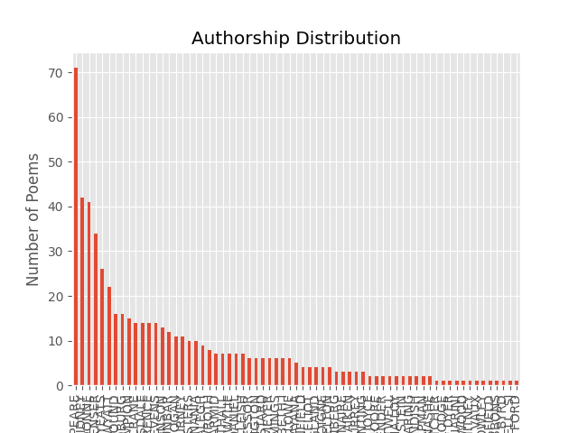
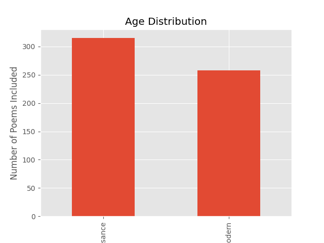
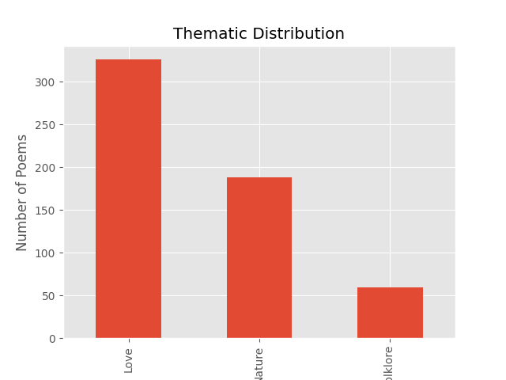

# Moment, Meaning, and Metaphor: A computational comparison of metaphor use and semantic evolution between modern and Renaissance English poetry across the themes of love, nature, and mythology

<div style="text-align: justify">

## Installing and Implementing my Code

### 1. Setting up the repository

In your terminal, type or copy-paste:
```
git clone https://github.com/paigetomkins/PoeticMetaphorAnalysis.git
```
and press Enter. You should now have a local clone of this repository.

### 2. Importing the Dataset

The full dataset for my project can be found in this repository under "fulldataset.csv." Upon opening that file, there should be an option to download the raw file if you click on the arrow button on the right-hand side as seen below.


The file is about 590 kBs; ensure that you have the space available to complete the download.

If, for whatever reason, these steps do not work for you, you can find the original dataset at [https://www.kaggle.com/datasets/ultrajack/modern-renaissance-poetry/data](https://www.kaggle.com/datasets/ultrajack/modern-renaissance-poetry/data). However, please note that it may have been altered and thus prevent you from getting the same results as me. 

###3. Installing Necessary Libraries

The following are all of the libraries required to execute my code. While not all of them are required to run every program, I recommend that you install them all upfront. 

####Python

```
sudo apt install python
```

####pip

```
sudo apt install pip
```

####numpy

```
pip install numpy
```

####scipy

```
pip install scipy
```

####sklearn

```
pip install sklearn
```

####matplotlib

```
pip install matplotlib
```

####spacy

```
pip install spacy
```

####textacy

```
pip install textacy
```

####pandas 

```
pip install pandas
```

### 4. Arranging the Dataset

This step will turn the full dataset, which is a .csv file, into a list of Python dictionaries.

Prerequisites: You must have a recent (as of 2024) Python version installed (for the exact syntax I used to work, Python 3.12 is the only version I'm certain won't give you trouble; otherwise, you risk getting error messages resulting from previous or later syntax changes).

Open a terminal and change into the repository:

```
cd PoeticMetaphorAnalysis
```

And then change into the All-Code folder where, as the name sugggests, all of my code is located:

```
cd All-Code
```

From there, you can run the Python program import-data-as-dictlist.py:

```
python3 import-data-as-dictlist.py
```

Alternatively, you can copy the code for this step, titled [import-data-as-dictlist.py](https://github.com/paigetomkins/PoeticMetaphorAnalysis/blob/main/All-Code/import-data-as-dictlist.py), under the All-Code folder of the repository. By clicking the Copy button (located on the left of the Download button pictured in the previous step), you have created a copy of the code that can then be pasted into Emacs or a similar text editor and run in the terminal under the All-Code section of the repo.

### 5. Running Exploratory Data Analysis on the File

This step will allow you to run some checks on the dataset to ensure its reliability and functionality, and also generate some graphs to visualize the various distributions present in the data.

If you followed the above steps correctly, you should be in the All-Code folder of the repo in your terminal (if not, please reference the steps above to navigate there). To run the Python file, type:

```
python3 exploratory-data-analysis.py
```

This should print out some basic statistics related to the dataset (e.g., number of missing values, number of duplicate values, etc.) and offer you three graphs: One visualizing the authorship distribution, one for the thematic distribution, and one for the time period distribution. If the graphs look different than mine (featured below in Part 1 of the Methodology section), ensure that you have downloaded the same dataset as me and that you did not edit other lines of code in the file.

### 6. Metaphor Extraction

This step will take the preexisting dataset, extract the metaphors from the poetic content, and return those metaphors (as well as the number of detected metaphors present per poem) in a new column titled "metaphors." To execute the program, simply type:

```
python3 metaphorextraction.py
```

And wait. Please note that given the size of the corpus and the task at hand, it can often take a few minutes for the program to run. The output will be the new dataset, complete with the additional two columns (the self-explanatory "metaphors" and "number of metaphors"). 

## Working research question: 
Between Renaissance and modern English poetry, in what ways has the use of metaphor in poetry changed over time with regards to theme, authorship, and metaphor-to-poem-length ratio, and how can these changes be quantified and modeled by a computer program?

## Abstract:
Both metaphor and poetry, despite being ubiquitous forms of communication spanning across numerous cultures and histories, are often overlooked in linguistic research due to the difficulty of computationally understanding and quantifying what are often complex and multi-layered artistic processes. However, an understanding of the changes and history of poetic metaphor can offer insights into the use of such language, which, while not the most efficient medium of communication, still remains pervasive in modern and ancient society alike. The intention of my project was to plot the evolution of metaphor use in different eras, styles, and themes of poetry using a combination of heuristic and statistical machine-learning models. Unlike similar projects that focused on the use of computational linguistics in poetry as a means of interpretation or incorporated visual or phonemic information, my project aims to use computer models to analyze the evolution of poetic style without regards to poetic understanding (Herbelot, 2015; Shutova et al, 2016; Kesarwani, 2018). By combining various methods of semantic extraction with more advanced machine learning techniques, including word embedding and cosine similarity, I hope to model the changes in poetic metaphor use across time, authorship, and theme.

## Introduction:
In the words of Aurelie Herbelot (2015), poetry is not a typical focus of linguistic research because it "is expected to defy the accepted rules of ordinary language, and thus is not a particularly good example of the efficient medium we use to communicate in everyday life." However, this does not mean that poetry is a complete departure from everyday speech, since it is still widely read and understood across multiple cultures, locations, languages, and time periods. In addition, poetry, like everyday speech, differs across time and place and thus needs to be analyzed accordingly. Metaphor, too, is often overlooked in linguistic research due to the higher-level connections that must be made in order to understand the connection between two apparently unrelated things--and yet, we humans frequently use and understand metaphor in our use of language. As a result, it is important for both poetry and metaphor to be understood by a computational model in the same way that ordinary language is understood. Additionally, by understanding the evolution of poetic metaphor, we can get a firmer grasp on the often abstruse nature of artistry in human language and better understand the evolution of language in its entirety. Thus, it is important to understand not only the use of metaphor in poetry, but how that use has altered over time, and to investigate the possible shifts in metaphor use from the epics and sonnets of old to the contemporary, idiosyncratic poetry of today.

## Background:
The broader topic of my project--computational linguistics--can essentially be defined as the use of computers to investigate and expand the field of linguistics, which is the study of language as a whole. While linguistics is an incredibly broad field involving a variety of methods, branches, and (often contradictory) theories, the field I chose to focus on is semantics, which is the study of meaning in language. Semantics itself also has a variety of varying sub-branches, views, and methods of study. A few common methods of computational analysis used in semantics include: 

Tagging: The process of marking the words in a corpus with their corresponding part of speech. Tagging was first used on a serious corpus with the Brown Corpus, the first major structured corpus of English literature, first developed in the 1960s by Henry Kucera and W. Nelson Francis at Brown University (cn). Since then, multiple different kinds of supervised and unsupervised tagging models have been developed. The most common type of POS tagging today is likely the Penn tag set developed in the Penn-Treebank project, which is the tagging method of choice for many annotated datasets and corpora. 

Parsing: A method of semantic analysis which enables one to gain a better understanding of a text by breaking it down into different syntactic parts and associations. Parsing is a particularly difficult task for computers to perform due to the multitude of ambiguities in human language; yet, an understanding of syntax in language is essential to create meaning (for instance, the sentence "The bird is in the tree" is very different from "The tree is in the bird," despite identical vocabulary usage). Additionally, different researchers choose to train their models in different ways, with grammar, training data, and statistical models altering from person to person. Most models, despite advancements in machine learning, still require some form of manual parsing before they are able to perform or understand parsing themselves, thus increasing the resources necessary for successful parsing. Thankfully, there are a number of open-source software programs that can perform complex dependency parsing quickly, allowing researchers to easily and efficiently parse their own datasets with less difficulty.

Word embedding: The process of transforming the words that are more easily understood by humans into numerical vectors that are more easily understood by computers based on the context surrounding the word. The idea behind word embedding, that "a word is characterized by the company it keeps," was first suggested in a 1957 article by the linguist John Firth (cn) and resulted in the development of word embedding, which

While these methods, in addition to many more, can be used for a variety of linguistic research, I am using them specifically to analyze metaphor in poetry. For the purposes of my research, a metaphor can be defined as a figure of speech in which a word or phrase that can literally describe one object is instead used to describe another in a non-literal way, thus implying hidden connections between the two different ideas. A person can have a "heart of gold," for instance, despite not literally have a heart made from an expensive transition metal, and while it is often said that "the eyes are the windows to the soul," most people's eyes are not actually panes of glass that we can peer through; such phrases are common examples of metaphors, and while it does not take long for humans to identify and understand a metaphorical expression, the task can be an unusually challenging one for computers. Additionally, metaphor use in poetry can quickly become enigmatic, conveying several layers of meaning far beyond what the poem literally says and requiring deep analysis in order to be fully understood; the problem of full metaphor comprehension, however, has been left for future research. Computers' challenges with metaphor identification likely stem from the process, albeit implicit, by which we come to identify a metaphor--not only do we need to understand the meaning of both words involved, a task that is already elaborate for computers, but we need to understand that the relationship between those objects is unlikely to be literal through a combination of context, past experience, and logical reasoning. Thus, to train a computer to perform this task with a high level of accuracy often takes quite a bit of time and resources. My project aims to overcome some of those costs and constraints while still successfully extracting metaphors from poetic text by utilizing pre-trained and open-source technology as well as linguistic patterns that are characteristic of metaphor identification in order to successfully extract metaphors and accurately analyze shifts in poetic metaphor use between eras, authors, and themes.

#### Related works
Previous models have attempted to identify metaphor not only through vectors and machine learning, but also through methods like visual representation, text annotation, and more (Shutova et al, 2016; Kesarwani, 2018). My project is essentially a simplified version of previous related works, removing visual representation and manual corpus annotation in favor of a simpler approach.


## "Methodology":
### 1. Dataset Selection

For my dataset, I have selected the Kaggle open-source dataset "Poems from poetryfoundation.org," which is a collection of poems from Poetry Foundation assembled by the user ultra-jack and licensed under the CC0 Public Domain license. The collection is sorted based on general time period ("Renaissance" or "Modern"), author, and theme ("Love," "Nature," or "Mythology and Folklore"). There are a total of 509 poems from 462 authors and a relatively even distribution of time period. There are only two unknown values (both for author) in the entire dataset, but there were 64 duplicate poems. In order to minimize the effects of this, I am using a copy of the dataset with the duplicates removed (although the poems that contain an unknown author remain, since only two existed and the poetic content, theme, and era were all preserved). Since the poems were collected from Poetry Foundation, it can be assumed that they also cover a wide range of regions and possibly languages, though all of the poems are offered in English and no information is given regarding language or region. Although the theme of the poetry is skewed, with "Love" accounting for 57% of poems, this is unlikely to have a severe effect on my results as the skew appears to occur across both eras of poetry, allowing for an even distribution of theme between them, and there is still a fair amount of "Nature" and "Mythology and Folklore" poems. The dataset contains no linguistic annotation and is downloaded in the form of a single .csv file containing all of the poems. I have selected this dataset over similar Kaggle or Project Gutenberg corpora due to its organization of multiple categories, few missing values, simple format, and wide authorship distribution, all of which enable me to easily sort my data and have greater faith in my results.







### 2. Importing and processing the corpus

I downloaded the dataset in the form of a single, 243-kilobyte .csv file from the Kaggle website where it was found; the process was fast and uneventful. Running exploratory data analysis on the file, I produced the above graphs and information regarding authorship, duplicates, and null values. Additionally, it should be noted that I was able to easily manipulate and extract information from all columns without difficulty and did not encounter any corruption or other abnormalities.

### 3. Extracting and isolating metaphors based on POS tag sequences and dependency parsers

I am using the approach taken by Neuman et al (2013) and Kesarwani (2018): Rather than annotating poetry line by line in order to identify metaphor, I chose to use the various POS tag sequences described by Kesarwani to automatically extract the majority of metaphorical phrases and sentences from the corpus. This is an important step towards extracting all of the metaphors used in the corpus, and relies on simple, rule-based directions, making it a relatively fast and efficient process. As Kesarwani pointed out, however, POS tagging can sometimes result in incomprehensible word pairs; in the event of this happening, I plan to use the Berkeley Neural Parser (integrated in SpaCy) in order to identify the surrounding context. An additional caveat of this process is that it also extracts many non-metaphorical POS sequances; this is not a concern at this stage, however, since further methods of semantic analysis will be applied with the intention of "filtering" the real metaphors and discarding literal phrases, and my main intention with this step is to isolate as many potential metaphors as possible before further narrowing them down, since it is preferable to have too many phrases in the beginning than to move too quickly and ultimately discard real metaphors. My choice to use SpaCy rather than the Stanford Parser and Dependency Parser selected by Kesarwani is due to the fact that SpaCy is both open-source, an important aspect of the project, and pre-trained, significantly reducing the time and cost of this step. Additionally, SpaCy is known to operate much faster than Stanford GloVe, which is my primary reason for choosing it (Honnibal & Montani, 2017). 

### 4. Create high-dimensional vectors using word embeddings

In order to calculate the vectors of the isolated metaphors, I plan to use gensim to find word-level embeddings. Although gensim was originally designed for topic modeling, it is good at training word vectors and adding them into SpaCy, which will allow me to take advantage of both libraries to maximize the speed and accuracy of the machine-learning section. I initially planned to use fasttext, but after memory problems and other malfunctions, gensim became a better choice. (more to be added later)
Fasttext uses, like its alternative word2vec, a skip-gram model, but unlike word2vec or Stanford GloVe (which was used by both Kesarwani and Shutova), fasttext first breaks the words into n-grams before feeding them into the neural network, which resolves the problem faced by GloVe and word2vec in which words out of the model's vocabulary cannot be encoded. I plan to use a 100-dimensional vector representation, as that was the number of dimensions used by both Kesarwani and Shutova, and because another person who tried to find the optimal number of dimensions for word embeddings concluded that close to 100 dimensions (85, to be exact) was optimal (Kwan, 2023). At the moment, I plan to train for three epochs; not only is this the number used by Shutova, but it was also the number used by Google, and is large enough to provide accuracy without the risk of overfitting or costing me too much time.

### 5. Use a pre-trained statistical-based machine learning model and cosine similarity to further detect metaphor in the selected sentences

Before calculating the cosine similarity, I first need to create a threshold at which a phrase is considered a metaphor; I plan to do this in a similar way to how Shutova (2016) did it in their research. I plan to use a small collection of phrases that have been manually annotated for whether they are metaphorical or literal, and then calculate the cosine similarity between the two parts of the metaphor (e.g., two nouns, a noun and a verb, etc.). By averaging those numbers, it is possible to create a threshold for what cosine value would classify a certain phrase as a metaphor, and thus discard the phrases that exceeded that threshold as likely being literal. For the manually annotated datasets, I am planning to use the dataset created by Mohammed et al (2016), in which verb-noun pairs were gathered from WordNet, a large database of English words maintained by Princeton University, and annotated for metaphoricity by annotators from a crowdsourcing platform. Only the tagged pairs that reached 70% or higher agreement across annotators were used in the final set. I also plan to use the Tsvetkov et al (2014) dataset of noun-adjective pairs . I chose both of these datasets because they each look at different word pairs (noun-adjective vs noun-verb), they include literal phrases in addition to metaphorical ones, and because they focus simply on annotating and identifying metaphors rather than interpreting them like other researchers (Zayed et al, 2020). 

### 6. Generating a plot

Finally, after using the various aforementioned methods to find the metaphors in the poetry corpus, I plan to generate a plot comparing the different numbers of metaphors found across different time periods (or whatever the final variables are). The X-axis will be a measure across time, presumably measured in decades; the Y-axis will be a measure of the number of metaphors present in the poems of that year within the corpus. I plan to use matplotlib in Python to create my plot; Seaborn was another option, but I opted for matplotlib since it works particularly well for basic visualizations like the one I will be making and is more compatible with the other libraries I am familiar with (Sial et al, 2021).

### Testing:

### Licensing and Usage:
I have used exclusively open-source software and materials to conduct my research; as such, all of my code, in addition to my paper and other associated files, are open for public use, replication, and modification.

## "Results":
...


## Sources used* (alphabetized): 
### Author's Name. Title of paper. Relevance (or lack thereof).

Feng, Y. and Lapata, M. (2010). Visual information in semantic representation. Relevant.

Herbelot, A. (2014). The semantics of poetry: a distributional reading. Relevant.

Hermann, K. and Blunsom, P. (2014). Multilingual models for compositional distributed semantics. Fairly relevant but complicated.

Honnibal, M., & Montani, I. (2017). spacy 2: Natural language understanding with bloom embeddings, convolutional neural networks and incremental parsing. github.

Jones, M. and Mewhort, D. (2007). Representing word meaning and order information in a composite holographic lexicon. Relevant.

Kerarwari, V. (2018). Automatic poetry classification using natural language processing. Very relevant.

Mohammed et al (2016). Metaphor as a medium for emotion: An empirical study. Relevant.

Musaoglu et al (2017). Generic tool for visualizing patterns in poetry. Semi-relevant.

Neuman, Y. et al (2013). Metaphor identification in large texts corpora. PloS one, 8(4), e62343.

Plamodon, M. (2009). Poetic waveforms, discrete fourier transform analysis of phonemic accumulations, and love in the garden of Tennyson's Maud. Not relevant.

Shutova et al (2016). Black holes and white rabbits: Metaphor identification with visual features. Very relevant.

Sial et al (2021). Comparative analysis of data visualization libraries matplotlib and seaborn in python. Relevant. 

Zayed et al (2020). Figure me out: A gold standard dataset for metaphor interpretation. Not very relevant.

Zou et al (2013). Bilingual word embeddings for phrase-based machine translation. Not very relevant.based on the context surrounding the word

*I also used various articles and blog posts to quickly understand certain concepts, but most of them are not credible enough to cite and were not read in full.

</div>


			\hline
			Richard Barnfield & Cherry-lipt Adonis in his... & Sonnet 17 & Renaissance & Mythology and Folklore\\
			\hline
			Margaret Cavendish & A Poet am I neither born... & The Duchess to Her Readers & Renaissance & Love\\
			\hline
			Sara Teasdale & I saw her in a Broadway... & The Old Maid & Modern & Love\\
