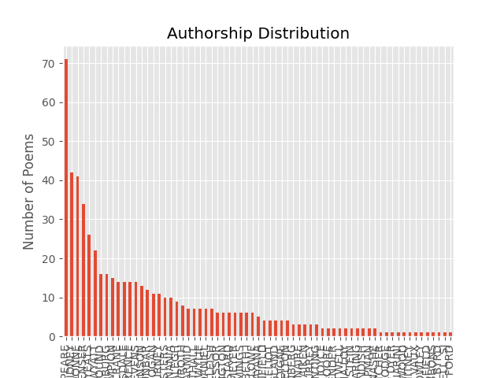
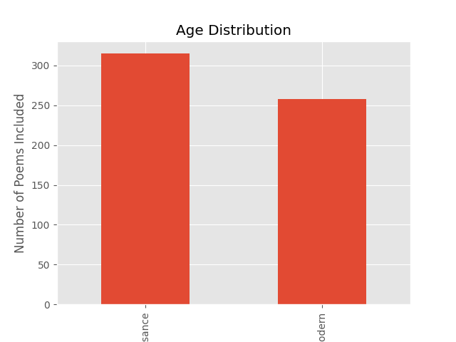
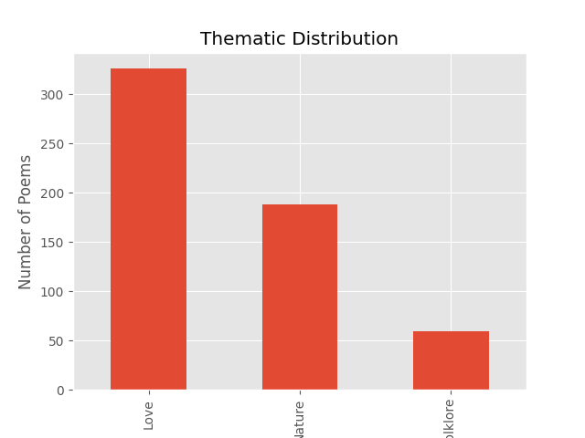
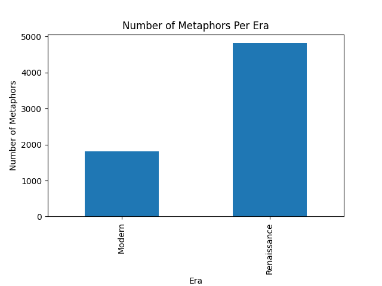
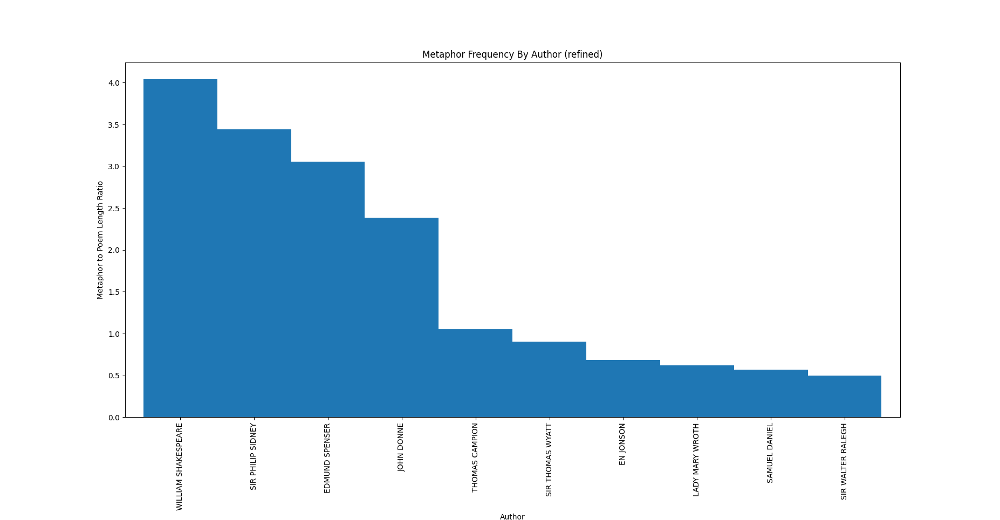

# Moment, Meaning, and Metaphor: A computational comparison of metaphor use and semantic evolution between modern and Renaissance English poetry across the themes of love, nature, and mythology

<div style="text-align: justify">

## Installing and Implementing my Code

### 1. Setting up the repository

In your terminal, type or copy-paste:
```
git clone https://github.com/paigetomkins/PoeticMetaphorAnalysis.git
```
and press Enter. You should now have a local clone of this repository.

### 2. Importing the Dataset

The full dataset for my project can be found in this repository under "fulldataset.csv." Upon opening that file, there should be an option to download the raw file if you click on the arrow button on the right-hand side as seen below.


The file is about 590 kBs; ensure that you have the space available to complete the download.

If, for whatever reason, these steps do not work for you, you can find the original dataset at [https://www.kaggle.com/datasets/ultrajack/modern-renaissance-poetry/data](https://www.kaggle.com/datasets/ultrajack/modern-renaissance-poetry/data). However, please note that it may have been altered and thus prevent you from getting the same results as me. 

###3. Installing Necessary Libraries

The following are all of the libraries required to execute my code. While not all of them are required to run every program, I recommend that you install them all upfront. (To see the versions of each library that I used, see the "Methods" section of my paper down below.)

####Python

For Python specifically, I recommend you find an online guide on installation that matches your individual operating system, newest version, and requirements (such as the one found [here](https://realpython.com/installing-python/)).

####pip

Or a similar package installer.
```
sudo apt install pip
```

####numpy

```
pip install numpy
```

####scipy

```
pip install scipy
```

####sklearn

```
pip install sklearn
```

####matplotlib

```
pip install matplotlib
```

####spacy

```
pip install spacy
```

####textacy

```
pip install textacy
```

####pandas 

```
pip install pandas
```

####regex

```
pip install regex
```

### 4. Arranging the Dataset

This step will turn the full dataset, which is a .csv file, into a list of Python dictionaries.

Open a terminal and change into the repository:

```
cd PoeticMetaphorAnalysis
```

And then change into the All-Code folder where, as the name sugggests, all of my code is located:

```
cd All-Code
```

From there, you can run the Python program import-data-as-dictlist.py:

```
python3 import-data-as-dictlist.py
```

Alternatively, you can copy the code for this step, titled [import-data-as-dictlist.py](https://github.com/paigetomkins/PoeticMetaphorAnalysis/blob/main/All-Code/import-data-as-dictlist.py), under the All-Code folder of the repository. By clicking the Copy button (located on the left of the Download button pictured in the previous step), you have created a copy of the code that can then be pasted into Emacs or a similar text editor and run in the terminal under the All-Code section of the repo.

### 5. Running Exploratory Data Analysis on the File

This step will allow you to run some checks on the dataset to ensure its reliability and functionality, and also generate some graphs to visualize the various distributions present in the data.

If you followed the above steps correctly, you should be in the All-Code folder of the repo in your terminal (if not, please reference the steps above to navigate there). To run the Python file, type:

```
python3 exploratory-data-analysis.py
```

This should print out some basic statistics related to the dataset (e.g., number of missing values, number of duplicate values, etc.) and offer you three graphs: One visualizing the authorship distribution, one for the thematic distribution, and one for the time period distribution. If the graphs look different than mine (featured below in Part 1 of the Methodology section), ensure that you have downloaded the same dataset as me and that you did not edit other lines of code in the file.

### 6. Testing and Accuracy

This step will yield the accuracy rating of my metaphor extraction program in Step 7, which for me is around 58%. Please note that this step opens up potential biases; for more detail, see the "Testing and Accuracy" portion of the "Methods" section of my paper below.

In the All-Code folder of the repo, type:

```
python3 testaccuracy.py
```
And you should get a decimal number that, when multiplied by 100, reflects the accuracy percentage of my metaphor extraction program.

### 7. Metaphor Extraction

This step will take the preexisting dataset, extract the metaphors from the poetic content, and return those metaphors (as well as the number of detected metaphors present per poem) in new columns added to the dataframe; it will also generate graphs that reflect the results of my project. To execute the program, simply type:

```
python3 metaphorextraction.py
```

And wait. Please note that given the size of the corpus and the task at hand, it can often take a few minutes for the program to run. The output will be the new dataset, complete with the additional columns. 

## Working research question: 
Between Renaissance and modern English poetry, in what ways has the use of metaphor in poetry shifted with regards to period, authorship, and metaphor-to-poem-length ratio, and how can these changes be quantified and modeled by a computer program?

## Abstract:
Both metaphor and poetry, despite being ubiquitous forms of communication spanning across numerous cultures and histories, are often overlooked in linguistic research due to the difficulty of computationally understanding and quantifying what are often complex and multi-layered artistic processes. However, an understanding of the changes and history of poetic metaphor can offer insights into the use of such language, which, while not the most efficient medium of communication, still remains pervasive in modern and ancient society alike. The intention of my project was to plot the evolution of metaphor use in different eras, styles, and themes of poetry using a combination of heuristic and statistical machine-learning models. Unlike similar projects that focused on the use of computational linguistics in poetry as a means of interpretation or incorporated visual or phonemic information, my project aims to use computer models to analyze the evolution of poetic style without regards to poetic understanding (Herbelot, 2015; Shutova et al, 2016; Kesarwani, 2018). By combining various methods of semantic extraction with more complex part-of-speech tag sequences, I hope to model the changes in poetic metaphor use across time and authorship.

## Introduction:
In the words of Aurelie Herbelot (2015), poetry is not a typical focus of linguistic research because it "is expected to defy the accepted rules of ordinary language, and thus is not a particularly good example of the efficient medium we use to communicate in everyday life." However, this does not mean that poetry is a complete departure from everyday speech, since it is still widely read and understood across multiple cultures, locations, languages, and time periods. In addition, poetry, like everyday speech, differs across time and place and thus needs to be analyzed accordingly. Metaphor, too, is often overlooked in linguistic research due to the higher-level connections that must be made in order to understand the connection between two apparently unrelated things--and yet, we humans frequently use and understand metaphor in our use of language. As a result, it is important for both poetry and metaphor to be understood by a computational model in the same way that ordinary language is understood. Additionally, by understanding the evolution of poetic metaphor, we can get a firmer grasp on the often abstruse nature of artistry in human language and better understand the evolution of language in its entirety. Thus, it is important to understand not only the use of metaphor in poetry, but how that use has altered over time, and to investigate the possible shifts in metaphor use from the epics and sonnets of old to the contemporary, idiosyncratic poetry of today.

## Background:
The broader topic of my project--computational linguistics--can essentially be defined as the use of computers to investigate and expand the field of linguistics, which is the study of language as a whole. While linguistics is an incredibly broad field involving a variety of methods, branches, and (often contradictory) theories, the field I chose to focus on is semantics, which is the study of meaning in language. Semantics itself also has a variety of varying sub-branches, views, and methods of study. A few common methods of computational analysis used in semantics include: 

Tagging: The process of marking the words in a corpus with their corresponding part of speech. Tagging was first used on a serious corpus with the Brown Corpus, the first major structured corpus of English literature, first developed in the 1960s by Henry Kucera and W. Nelson Francis at Brown University (cn). Since then, multiple different kinds of supervised and unsupervised tagging models have been developed. The most common type of POS tagging today is likely the Penn tag set developed in the Penn-Treebank project, which is the tagging method of choice for many annotated datasets and corpora. 

Parsing: A method of semantic analysis which enables one to gain a better understanding of a text by breaking it down into different syntactic parts and associations. Parsing is a particularly difficult task for computers to perform due to the multitude of ambiguities in human language; yet, an understanding of syntax in language is essential to create meaning (for instance, the sentence "The bird is in the tree" is very different from "The tree is in the bird," despite identical vocabulary usage). Additionally, different researchers choose to train their models in different ways, with grammar, training data, and statistical models altering from person to person. Most models, despite advancements in machine learning, still require some form of manual parsing before they are able to perform or understand parsing themselves, thus increasing the resources necessary for successful parsing. Thankfully, there are a number of open-source software programs that can perform complex dependency parsing quickly, allowing researchers to easily and efficiently parse their own datasets with less difficulty.

Word embedding: The process of transforming the words that are more easily understood by humans into numerical vectors that are more easily understood by computers based on the context surrounding the word. The idea behind word embedding, that "a word is characterized by the company it keeps," was first suggested in a 1957 article by the linguist John Firth (cn) and resulted in the development of word embedding, which is often considered a staple in modern machine learning.

For the purposes of my research, a metaphor can be operationally defined as a figure of speech in which a word or phrase that can literally describe one object is instead used to describe another in a non-literal way, thus implying hidden connections between the two different ideas. A person can have a "heart of gold," for instance, despite not literally have a heart made from an expensive transition metal, and while it is often said that "the eyes are the windows to the soul," most people's eyes are not actually panes of glass that we can peer through; such phrases are common examples of metaphors, and while it does not take long for humans to identify and understand a metaphorical expression, the task can be an unusually challenging one for computers. Additionally, metaphor use in poetry can quickly become enigmatic, conveying several layers of meaning far beyond what the poem literally says and requiring deep analysis, even by humans, in order to be fully understood; the problem of full metaphor comprehension, however, has been left for future research. Computers' challenges with metaphor identification likely stem from the process, albeit implicit, by which we come to identify a metaphor--not only do we need to understand the meaning of both words involved, a task that is already elaborate for computers, but we need to understand that the relationship between those objects is unlikely to be literal through a combination of context, past experience, and logical reasoning. Thus, to train a computer to perform this task with a high level of accuracy often takes quite a bit of time and resources. My project aims to overcome some of those costs and constraints while still successfully extracting metaphors from poetic text by utilizing pre-trained and open-source technology, as well as heuristics and linguistic patterns that are characteristic of metaphor identification, in order to successfully extract metaphors and accurately analyze shifts in poetic metaphor use between eras and authors.

#### Related works
Previous models have attempted to identify metaphor not only through vectors and machine learning, but also through methods like visual representation, text annotation, and more. Shutova et al (2016), for instance, incorporated visual information into semantic representation in order to enhance their model's metaphor identification accuracy; Kesarwani (2018), on the other hand, added both manual annotation and statistical machine learning models into their methodology in order to incorporate sophisticated metaphor identification capabilities into their model. Herbelot (2014) did something similar through the use of distributional semantics in poetic analysis. My project is essentially a simplified version of such previous related works, removing visual information, statistical machine learning, manual corpus annotation, and distributional semantics in favor of a simpler approach. Though my methods may not be as elaborate as those of other researchers, I believe that my results demonstrate the promise of even simple computer models in better mapping and understanding the intricacies of human language.


## "Methodology":
### 1. Dataset Selection

For my dataset, I have selected the Kaggle open-source dataset "Poems from poetryfoundation.org," which is a collection of poems from Poetry Foundation assembled by the user ultra-jack and licensed under the CC0 Public Domain license. The collection is sorted based on general time period ("Renaissance" or "Modern"), author, and theme ("Love," "Nature," or "Mythology and Folklore"). There are a total of 509 poems from 462 authors and a relatively even distribution of time period. There are only two unknown values (both for author) in the entire dataset, but there were 64 duplicate poems. In order to minimize the effects of this, I am using a copy of the dataset with the duplicates removed (although the poems that contain an unknown author remain, since only two existed and poetic content, theme, and era were all preserved). Since the poems were collected from Poetry Foundation, it can be assumed that they also cover a wide range of regions and languages, though all of the poems are offered in English and little information is given regarding language or region. The dataset contains no linguistic annotation and is downloaded in the form of a single .csv file containing all of the poems. I have selected this dataset over similar Kaggle or Project Gutenberg corpora due to its organization of multiple categories, few missing values, simple format, and wide authorship distribution, all of which enable me to easily sort my data and have greater faith in my results.







### 2. Importing and processing the corpus

I downloaded the dataset in the form of a single, 243-kilobyte .csv file from the Kaggle website where it was found; the process was fast and uneventful. Running exploratory data analysis on the file using the Python library pandas (version 2.2.2; Python version 3.12.3), I produced the above graphs and information regarding authorship, duplicates, and null values. Due to the original datset owner's decision to duplicate poems with multiple themes and store each duplicate under a separate theme, thus creating problems in obtaining dataset counts and cleaning the dataframe, I decided to remove the 'type' column of the dataset, which described theme, from my research in order to maintain accuracy and preserve a reliable data structure. Additionally, the dataset is only read in and processed from rows zero through five hundred seven, as processing difficulties (likely stemming from typos or similar problems within the dataframe) resulted in my eliminating later rows. It should also be noted that notwithstanding the previous complications, I was able to easily manipulate and extract information from all sections of the dataset without difficulty, as well as add and fill columns of my own, and did not encounter any corruption or other abnormalities.

### 3. Extracting and isolating metaphors based on POS tag sequences and dependency parsers

I am using the approach taken by Neuman et al (2013) and Kesarwani (2018): Rather than annotating poetry line by line in order to identify metaphor, I chose to use the various POS tag sequences described by Kesarwani to automatically extract the majority of metaphorical phrases and sentences from the corpus. While the five types of metaphors provided by Kesarwani did successfully extract some of the metaphors present in the corpus, I observed the accuracy rate of this to be low. This is possibly due to the presence of Renaissance-era poems in my dataset: The older language and grammar styles may have negatively impacted the effectiveness of sequences likely designed with modern speech in mind. Nevertheless, it is extremely important to introduce accurate POS tag sequences in my program in particular, as unlike Kesarwani's, it relies entirely on such heuristics for its accuracy and general performance. Thus, I improved and expanded the POS tag sequences used in my program by using the displacy extension of spaCy (version 3.7.5) in order to model the syntactic relationships between various words in my dataset poems and then apply those patterns to my POS tag sequences. By the end of my process, I had added five additional sequences to my program. Then, I used both spaCy and its counterpart textacy (version 0.13.0) to load a Natural Language Proocessing model, process the poems in the dataset, and extract the given sequences from the processed text, storing them in a new column of my dataframe. My choice to use spaCy rather than the Stanford Parser and Dependency Parser selected by Kesarwani is due to the fact that spaCy, like GloVe, is open-source, an important aspect of the project, and pre-trained, significantly reducing the time and cost of this step. Additionally, however, spaCy is known to operate much faster than Stanford GloVe, which is ultimately my primary reason for choosing it (Honnibal & Montani, 2017). 

### 4. Generating a plot

Finally, after using the various aforementioned methods to find and extract metaphors from the poetry corpus, I generated three plots comparing the overall number of metaphors used between Renaissance and modern poetry and the differences in authorial uses of poetic metaphor (see plots in "Results"). I chose to use matplotlib (version 3.9.1) in Python to create my plot; Seaborn was another option, but I opted for matplotlib since it works particularly well for basic visualizations like the one I will be making and is more compatible with the other libraries I am familiar with (Sial et al, 2021). In my generation of the plot mapping authorial use of poetic metaphor, I used the ratio of metaphor to poem length in order to standardize the frequency of metaphor usage.

### 5. Testing and Accuracy:

After developing my program, I needed to develop an accuracy test to ensure that my program was truly and consistently extracting metaphors from poetic content. I chose to use an F1 score, a common accuracy metric used among machine learning researchers, to test the accuracy of my program. Unfortunately, due to constraints in time and resources, I was the lone annotator, leaving a wide window for bias and thus limiting the reliabilty of my accuracy metric. I did, however, take multiple precautions to minimize the bias present in my calculations. My method was as follows: Firstly, I selected five poems, purposely choosing ones with little in common across period, authorship, and theme (which I included as a factor despite excluding it from my actual dataset in order to truly maximize the diversity of my selected poems); then, before running any sort of extraction on them, I annotated each of the poems for metaphor; lastly, I ran the metaphor extraction program on each of the poems, comparing my own annotations with the results offered by the model. At this step, I occasionally ran into cases of overlap--for instance, the metaphor "the trees bowed their heads" might be separated into two overlapping yet not identical phrases (e.g., "the trees bowed", "bowed their heads"). In this case, I surveyed each of the phrases separately; in most cases, one phrase would pass as metaphorical, while the other would not. All ambiguous cases were handled with the highest possible level of objectivity. After developing the corresponding true and predicted value arrays, the F1 score was calculated using the scikit-learn library (version 1.5.1), which resulted in an overall accuracy of approximately 57.8%.

### 6. Licensing and Usage:

I have used exclusively open-source software and materials to conduct my research; as such, all of my code, in addition to my paper and other associated files, are open for public use, replication, and modification.

## Results and Discussion:





My first plot, which modeled the change in overall number of metaphors used across time period, revealed that roughly 2,000 metaphors were used in modern poetry, compared with almost 5,000 used in Renaissance poetry. Despite the two periods having slightly different numbers of poems within the dataset (55% Renaissance, 45% Modern), the drastic different in metaphor usage suggests that metaphor use, at least on a word-by-word scale, has substantially decreased in modern times. This can be explained at least in part by the rise of modernism and postmodernism in poetry, starting in around 1890 and continuing through the present; modernist poetry, according to author James Longenbach (1997), was "critical of its culture, of its immediate past, of itself" (p. 6), and was determined to break the mold of conventional poetic style, including the use of metaphor. Thus, a drop in metaphor use likely not only reflects a repudiation of traditional literary techniques, but perhaps also a more unconventional sense of reflecting metaphor that is more difficult for a heuristics-based model to detect.

My second plot, which modeled the differences in authorial use of poetic metaphor, reflected the trend observed in the previous plot, as each and every one of the top ten authors (in terms of metaphor usage) were Renaissance figures; additionally, the majority of the figures are to this day considered deeply influential literary figures, with William Shakespeare, John Donne, and Sir Walter Ralegh each making heavy use of metaphor in their poems. This possible correlation between metaphor usage and literary influence not only suggests that metaphor usage is characteristic of high-quality writing, but that we as humans are naturally drawn to metaphor usage, seeing as we elevate to fame literary figures with frequent metaphor usage in their work.

## Conclusion:

Despite the simplicity and rigidity of heuristic models, my research has demonstrated that they can nevertheless be effective at identifying metaphor in poetry, and that they may prove efficient and thus useful tools for natural language processing and literary analysis in general. Poetry, too, despite its reputation for idiosyncrasy and unpredictability, can still be better understood and modeled by computer programs, even the more rudimentary ones. For future research, a general expansion of the methodology would likely produce more accurate and interesting results; by incorporating statistical machine learning and even deep learning into the metaphor extraction program, my results would rise in reliability and offer deeper insights into the evolution of metaphor and poetic style as a whole. Ultimately, the obscurities, irregularities, and idiosyncrasies of metaphor and poetry are what characterize them as uniquely human gifts, and are part of what makes them such fascinating topics of research. By gaining further, deeper insights into poetic literature, we can in turn gain a deeper understanding of human artistry itself.

### Acknowledgements:

I would like to thank my mentor, Rachel Hopkins, for her invaluable help in guiding my research and answering my questions; I would also like to thank the Institute for Computing in Research for the opportunity to learn such beneficial skills.

## References: 

Feng, Y., & Lapata, M. (2010). Visual information in semantic representation. In Human Language Technologies: The 2010 Annual Conference of the North American Chapter of the ACL (pp. 91-99). Association for Computational Linguistics.

Herbelot, A. (2015). The semantics of poetry: A distributional reading. Digital Scholarship in the Humanities, 30(4), 516-531.

Hermann, K. M., & Blunsom, P. (2014). Multilingual models for compositional distributed semantics. arXiv preprint arXiv:1404.4641.

Honnibal, M., & Montani, I. (2017). spacy 2: Natural language understanding with bloom embeddings, convolutional neural networks and incremental parsing. github.

Jones, M. N., & Mewhort, D. J. (2007). Representing word meaning and order information in a composite holographic lexicon. Psychological review, 114(1), 1.

Kerarwari, V. (2018). Automatic poetry classification using natural language processing.

Neuman, Y. et al (2013). Metaphor identification in large texts corpora. PloS one, 8(4), e62343.

Shutova, E., Kiela, D., & Maillard, J. (2016, June). Black holes and white rabbits: Metaphor identification with visual features. In Proceedings of the 2016 conference of the North American chapter of the association for computational linguistics: Human language technologies (pp. 160-170).

Sial, A. H., Rashdi, S. Y. S., & Khan, A. H. (2021). Comparative analysis of data visualization libraries Matplotlib and Seaborn in Python. International Journal, 10(1), 277-281.

Zou, W. Y., Socher, R., Cer, D., & Manning, C. D. (2013, October). Bilingual word embeddings for phrase-based machine translation. In Proceedings of the 2013 conference on empirical methods in natural language processing (pp. 1393-1398).
</div>
